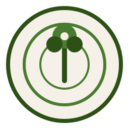

# Mapa Vivo — Visão Geral do Produto



**Plataforma SaaS de inventário arbóreo digital**
por **Agrosintropia** | Goiânia, GO — Brasil

---

## Identidade Visual

A logo do Mapa Vivo é composta por círculos concêntricos (evocando anéis de crescimento de uma árvore ou um alvo de mapa) com uma silhueta estilizada de árvore ao centro — um tronco vertical encimado por três esferas que representam a copa. O conceito visual traduz a convergência entre cartografia digital e patrimônio vegetal vivo.

A paleta de cores é inspirada no bioma Cerrado:

| Cor | Hex | Uso |
|-----|-----|-----|
| Verde Cerrado | `#2D5016` | Cor primária, textos principais, tronco da logo |
| Verde Médio | `#4A7C2F` | Botões, destaques, copa da logo |
| Terracota | `#C4622D` | Alertas, botões secundários |
| Ocre | `#D4A017` | Badges, informações, avisos |
| Areia | `#F5F0E8` | Fundo claro, fundo da logo |

As fontes são **Fraunces** (display/títulos, serifada com personalidade editorial) e **Source Sans 3** (corpo de texto, sans-serif legível), ambas carregadas via Google Fonts.

O subtítulo institucional é **"Inteligência Urbana Verde"**.

---

## 1. Resumo Executivo

O Mapa Vivo é uma plataforma SaaS desenvolvida pela empresa Agrosintropia (Goiânia, GO) para gestão digital de áreas verdes urbanas. Cada árvore de um condomínio, parque ou agrofloresta recebe uma identidade digital completa: localização GPS no mapa interativo, ficha técnica com dados botânicos, plaquinha física com QR code individual, fotos, histórico de eventos e estimativa de carbono sequestrado.

A plataforma opera em quatro perfis de acesso — morador, gestor, técnico ambiental e administrador — interligando o ecossistema de monitoramento: o técnico faz o inventário em campo com ferramentas digitais; o gestor administra o projeto e seus moradores; os moradores exploram o mapa e reportam observações; e o administrador da Agrosintropia gerencia planos, cobranças e solicitações de serviço.

O produto se encontra em estágio de MVP funcional, com deploy em produção na Railway (URL: `mapa-vivo-production.up.railway.app`). Todas as funcionalidades descritas neste documento estão implementadas e operacionais, exceto onde explicitamente indicado como parcial ou planejado. O projeto-piloto é o "Residencial Mata Viva", um condomínio em Goiânia com inventário-semente de 125 árvores e 250 espécies catalogadas.

O modelo de negócio combina assinatura mensal recorrente (planos de R$ 479 a R$ 1.379/mês), taxas de setup únicas, cobranças por visitas técnicas sob demanda, venda de plaquinhas com QR code (R$ 3,90/unidade) e revisões técnicas online. A vigência de cada plano é de 12 meses a partir da ativação, controlada automaticamente pelo sistema.

---

## 2. Problema e Público-Alvo

### Problema

Condomínios residenciais, parques urbanos e incorporadoras no Brasil não dispõem de ferramentas adequadas para inventariar, monitorar e comunicar o patrimônio arbóreo de suas áreas verdes. Na prática, isso significa:

- Nenhum registro organizado de quantas árvores existem, quais são as espécies ou seu estado de saúde.
- Ausência de histórico de podas, plantios, tratamentos e ocorrências fitossanitárias.
- Moradores sem canal para reportar problemas (galhos em risco, árvores doentes, pragas).
- Impossibilidade de medir e comunicar o impacto ambiental positivo (carbono sequestrado, biodiversidade).
- Visitas técnicas realizadas com anotações em papel, sem ferramentas digitais de registro em campo.
- Árvores sem identificação física acessível ao público.
- Dificuldade em cumprir exigências legais de inventário e planos de manejo.

### Público-Alvo

| Persona | Descrição |
|---------|-----------|
| **Gestor de condomínio** | Síndico profissional ou administrador predial que precisa de relatórios para assembleias, quer minimizar riscos legais e necessita de laudos técnicos para podas e remoções. |
| **Técnico ambiental / Arborista** | Engenheiro agrônomo, florestal ou biólogo que realiza inventários e laudos em campo, precisa de ferramenta mobile para coleta e validação de dados. |
| **Morador** | Usuário final da área verde que deseja conhecer as árvores do seu entorno, reportar problemas e acompanhar o impacto ambiental do projeto. |
| **Incorporadora** | Empresa que precisa demonstrar compromisso ambiental para clientes e órgãos licenciadores, documentar compensação ambiental e gerar relatórios de carbono como diferencial de marketing. |

---

## 3. Descrição do App, Proposta de Valor e Diferenciais

### Descrição

O Mapa Vivo é uma aplicação web responsiva (PWA-ready) construída com Next.js 14, que roda no navegador de qualquer dispositivo — celular, tablet ou desktop — sem necessidade de instalar aplicativo nativo. O sistema combina um mapa interativo georreferenciado (Leaflet/OpenStreetMap) com um painel de gestão, dashboard ambiental com gráficos, catálogo de 250 espécies brasileiras, sistema de QR codes para identificação física e fluxo de trabalho completo para visitas técnicas em campo.

### Proposta de Valor

Transformar áreas verdes de condomínios e parques em ativos ambientais documentados, monitorados e comunicados — gerando valor ecológico mensurável, engajamento dos moradores e conformidade legal.

### Diferenciais

1. **Identidade digital por árvore** — cada indivíduo arbóreo possui ficha técnica completa acessível via QR code, sem app.
2. **Validação técnica com selo de confiabilidade** — três níveis de confiança dos dados (validado por técnico, pendente, declarado pelo gestor).
3. **Catálogo de biodiversidade brasileiro** — 250 espécies com dados botânicos, ecológicos e de fauna atraída, cobrindo Cerrado, Mata Atlântica, Amazônia, Caatinga e espécies exóticas.
4. **Estimativa de carbono** — cálculo automático de biomassa e CO₂ equivalente por árvore e projeto.
5. **Fluxo de visita técnica digital** — o técnico cadastra árvores em campo com GPS automático, foto comprimida, identificação de espécie e marcação de plaquinha instalada, tudo em uma sessão rastreada.
6. **Engajamento de moradores** — moradores reportam observações (saúde, frutificação, fauna) diretamente do mapa, com fotos e áudio.

---

## 4. Modelo de Negócio

### Fontes de Receita

| Fonte | Descrição | Recorrência |
|-------|-----------|-------------|
| **Assinatura mensal** | Planos Básico (R$ 479), Standard (R$ 679) ou Premium (R$ 1.379) | Mensal |
| **Taxa de setup** | Cobrança única na ativação do projeto, valor configurável, parcelável | Única |
| **Visita técnica inicial** | Obrigatória — inventário, catalogação e instalação de plaquinhas | Única |
| **Visitas técnicas adicionais** | Taxa base (R$ 1.800 default) + custo de deslocamento | Sob demanda |
| **Plaquinhas com QR code** | R$ 3,90 por unidade instalada | Sob demanda |
| **Revisões técnicas online** | Taxa por lote de árvores revisadas remotamente | Sob demanda |

### Planos

| Recurso | Básico (R$ 479/mês) | Standard (R$ 679/mês) | Premium (R$ 1.379/mês) |
|---------|-----|----------|---------|
| Limite de árvores | 200 | 500 | 1.500 |
| Visitas técnicas inclusas/ano | 0 | 1 | 2 |
| Mapeamento + QR codes | Sim | Sim | Sim |
| Painel do gestor | Sim | Sim | Sim |
| Observações de moradores | Sim | Sim | Sim |
| Sub-áreas ilimitadas | — | Sim | Sim |
| Relatório de diversidade | — | Sim | Sim |
| Exportação CSV | — | Sim | Sim |
| API de integração | — | — | Sim |
| Suporte prioritário | — | — | Sim |

**Vigência**: 12 meses automáticos a partir da ativação do plano (campo `plan_expires_at` no banco).

### Unit Economics (por projeto)

Fato (visto no código): a taxa base de visita técnica é R$ 1.800 (campo `base_fee` default no model `TechnicalVisit`). A plaquinha custa R$ 3,90 para o cliente (campo `tag_unit_price` default). O campo `tag_margin` existe no schema com default de 0.30, mas o cálculo atual no admin usa o preço como valor final, sem multiplicar margem.

---

## 5. Funcionalidades

| Funcionalidade | Descrição | Status | Localização no código |
|---|---|---|---|
| Mapa interativo georreferenciado | Leaflet com CircleMarkers coloridos por espécie, polígono do limite do projeto, filtros por espécie e subclasse, legenda colapsável | Pronto | `components/LeafletMap.tsx`, `components/MapView.tsx`, `components/FilterBar.tsx`, `components/MapLegend.tsx` |
| Ficha pública da árvore via QR code | Página sem autenticação com fotos, dados botânicos, medidas, timeline de eventos, badge de tag instalada | Pronto | `app/arvore/[qr_slug]/page.tsx` |
| Dashboard ambiental | Cards de métricas, estimativa de carbono (biomassa + CO₂eq), gráficos de estrato, status e espécies (Recharts) | Pronto | `app/[projectSlug]/dashboard/page.tsx`, `components/Dashboard.tsx`, `components/DashboardCharts.tsx` |
| Cadastro de árvores | Formulário com autocomplete de espécie, captura GPS, foto com compressão client-side (WebP, 800px max), 3 campos de foto, data de plantio | Pronto | `components/TreeForm.tsx`, `app/[projectSlug]/painel/arvores/nova/page.tsx` |
| Visita técnica digital | Sessão rastreada com ações (adicionar/editar/remover árvore, editar espécie, criar sub-área), marcação de plaquinha, histórico de ações | Pronto | `app/[projectSlug]/visita/VisitSession.tsx`, `app/api/visits/` |
| Geração de QR codes | PDF em 3 tamanhos (40×50mm, 60×70mm, 80×100mm), ZIP com PNGs individuais, impressão direta, preview individual | Pronto | `app/[projectSlug]/painel/qrcodes/QRCodesClient.tsx`, `components/QRTag.tsx`, `components/QRBatchPrint.tsx` |
| Painel do gestor | Lista de árvores com filtros, fila de observações de moradores, gestão de moradores autorizados, link de convite | Pronto | `components/PainelClient.tsx`, `app/[projectSlug]/painel/` |
| Painel administrativo | Métricas globais, gestão de projetos (edição inline), técnicos, revisões, visitas, solicitações, plaquinhas, financeiro | Pronto | `app/admin/AdminDashboard.tsx`, `app/admin/page.tsx` |
| Observações de moradores | Modal com seleção de tipo, descrição, upload de fotos (múltiplas), gravação de áudio | Pronto | `components/ObservationModal.tsx`, `app/api/projects/[slug]/observations/` |
| Submissão de ocorrências | Formulário público para morador reportar árvore não cadastrada com geolocalização | Pronto | `components/SubmissionForm.tsx`, `app/[projectSlug]/submeter/page.tsx` |
| Sistema de revisão | Fila de revisão com aceitar/rejeitar/encaminhar para técnico/aguardar visita | Pronto | `app/[projectSlug]/painel/observacoes/page.tsx`, `app/api/observations/[id]/review/` |
| Criação de projetos | Formulário com upload de KML/KMZ para importar limite geográfico, sub-áreas, email do gestor | Pronto | `app/projetos/novo/NewProjectForm.tsx`, `app/projetos/novo/ProjectMapPreview.tsx` |
| Catálogo de 250 espécies | Dados fixos com nome popular, científico, família, bioma, estrato, descrição, função ecológica, fauna, subclasses, fator de carbono | Pronto | `lib/speciesData.ts`, `app/api/admin/seed-species/route.ts` |
| Autenticação Google OAuth | NextAuth v5 com sessão em banco, callback de role/project | Pronto | `lib/auth.ts`, `app/login/` |
| Controle de acesso por perfil | 4 roles (morador, gestor, técnico, admin) com redirecionamento automático | Pronto | `app/selecionar-papel/`, `app/api/profile/assign-role/` |
| Landing page pública | Hero, mapa demo com dados estáticos, dashboard demo, features, CTA | Pronto | `app/page.tsx`, `components/DemoMap.tsx` |
| Relatório de diversidade | Página imprimível com estatísticas de espécies, estratos, subclasses | Pronto | `app/[projectSlug]/relatorio/page.tsx` |
| Exportação CSV | Download do inventário completo em CSV | Pronto | `app/api/projects/[slug]/export/route.ts` |
| Solicitações de serviço | Gestor solicita visita/revisão/nova área; admin atribui técnico | Pronto | `app/api/service-requests/route.ts`, `app/api/admin/service-requests/route.ts` |
| Página de ajuda | FAQ accordion com guia de uso, serviços, contato | Pronto | `app/[projectSlug]/ajuda/AjudaClient.tsx` |
| Convite de moradores | Código único por projeto, verificação de email autorizado | Pronto | `app/convite/[code]/page.tsx`, `app/api/projects/join/` |
| Controle financeiro admin | Receita mensal, setup, visitas, plaquinhas, pagamentos pendentes | Pronto | `app/admin/AdminDashboard.tsx` (abas overview, visits, tags) |
| Expiração automática de plano | 12 meses ao atribuir plano, barra de progresso visual no admin | Pronto | `app/api/admin/assign-plan/route.ts` |
| Upload de fotos para Cloudinary | Armazenamento externo de fotos de árvores | Planejado | `.env.example` tem variáveis Cloudinary; `next.config.mjs` permite domínio; não há upload implementado |
| PWA nativo | Manifest existe, ícone SVG registrado, mas sem service worker | Parcial | `public/manifest.json`, `app/layout.tsx` (meta tags) |
| Reconhecimento de espécies por IA | Identificação automática via foto | Planejado | Mencionado em `SPEC.md` (Fase 4) |
| Gamificação ("Adote uma árvore") | Engajamento de moradores | Planejado | Mencionado em `SPEC.md` (Fase 4) |
| Notificações push | Alertas de eventos | Planejado | Mencionado em `SPEC.md` (Fase 4) |
| Integração Stripe (pagamentos) | Cobrança automatizada de planos | Planejado | Mencionado em `SPEC.md` (Fase 3) |

---

## 6. Fluxo de Funcionamento

### Jornada do Usuário

**Onboarding de um novo projeto:**

1. O gestor do condomínio/parque entra em contato com a Agrosintropia.
2. O administrador cria o projeto no sistema (`/projetos/novo` ou `/admin`), definindo nome, localização, bioma, plano e email do gestor. Pode importar um arquivo KML/KMZ para definir o polígono de limite geográfico.
3. O administrador agenda uma visita técnica inicial (obrigatória). O sistema marca `initial_visit_completed = false` no projeto.
4. Um técnico vai ao local e inicia uma sessão de visita digital (`/{slug}/visita`). Durante a visita, ele:
   - Cadastra cada árvore com GPS automático do celular, foto comprimida, identificação de espécie, medidas (DAP e altura).
   - Marca o checkbox "Plaquinha instalada" para cada árvore que recebe a tag física.
   - Pode criar sub-áreas, cadastrar novas espécies e editar dados existentes.
5. Ao finalizar a visita, o sistema marca `initial_visit_completed = true` e registra os custos (taxa base + deslocamento).
6. O técnico acessa a página de QR codes (`/{slug}/painel/qrcodes`), gera o PDF com as plaquinhas e imprime.
7. O gestor faz login com Google, é redirecionado ao dashboard do projeto com todas as árvores já cadastradas.
8. O gestor cadastra moradores autorizados (nome, email, telefone) e gera um link de convite com código único.
9. Os moradores fazem login com Google, o email é verificado contra a lista autorizada, e acessam o mapa.

**Uso contínuo:**

- **Moradores** exploram o mapa, escaneiam QR codes das plaquinhas para ver fichas, reportam observações (saúde, frutificação, fauna) com fotos e áudio.
- **Gestor** revisa observações dos moradores (aceitar/rejeitar/encaminhar), acompanha o dashboard ambiental, solicita serviços técnicos adicionais.
- **Técnico** atende solicitações, realiza visitas de atualização, valida árvores cadastradas pelo gestor.
- **Admin** monitora métricas globais, gerencia planos/cobranças, atribui solicitações a técnicos.

### Fluxo de Dados

```
Técnico (campo)         Gestor (painel)         Morador (mapa)
     |                       |                       |
     v                       v                       v
 VisitSession           TreeForm              ObservationModal
     |                       |                       |
     v                       v                       v
 API /visits/actions   API /trees (POST)     API /observations (POST)
     |                       |                       |
     +--------> PostgreSQL (Prisma) <----------------+
                     |
         +-----------+-----------+
         |           |           |
    Mapa (Leaflet)  Dashboard   Ficha pública
    CircleMarkers   (Recharts)  /arvore/[qr_slug]
```

---

## 7. Arquitetura e Estrutura de Desenvolvimento

### Stack Tecnológico

| Camada | Tecnologia | Versão |
|--------|-----------|--------|
| Framework | Next.js (App Router) | 14.2.35 |
| Linguagem | TypeScript (strict) | 6.0.3 |
| Estilização | Tailwind CSS | 3.4.19 |
| ORM | Prisma Client + adapter-pg | 7.8.0 |
| Banco de dados | PostgreSQL | — |
| Autenticação | NextAuth v5 beta | 5.0.0-beta.31 |
| Mapa | Leaflet + react-leaflet | 1.9.4 / 4.2.1 |
| Gráficos | Recharts | 3.9.0 |
| QR codes | qrcode (npm) | 1.5.4 |
| PDF | jsPDF | 4.2.1 |
| KML/KMZ | @tmcw/togeojson + JSZip | 7.1.2 / 3.10.1 |
| Deploy | Railway | — |

### Estrutura de Pastas

```
/
├── app/                          # Next.js App Router
│   ├── page.tsx                  # Landing page pública
│   ├── layout.tsx                # Layout raiz (fontes, metadata, PWA)
│   ├── globals.css               # Estilos globais + classes Tailwind custom
│   ├── login/                    # Página de login (Google OAuth)
│   ├── admin/                    # Painel administrativo
│   │   ├── page.tsx              # Dashboard admin (server component)
│   │   ├── AdminDashboard.tsx    # Tabs: visão geral, projetos, planos, técnicos, revisões, visitas, solicitações, plaquinhas
│   │   └── qrcodes/             # QR codes admin
│   ├── selecionar-papel/         # Seleção e troca de perfil
│   ├── projetos/                 # Lista de projetos (técnico) + criar novo
│   ├── convite/[code]/           # Página de convite por código
│   ├── arvore/[qr_slug]/         # Ficha pública da árvore (destino do QR)
│   ├── [projectSlug]/
│   │   ├── mapa/                 # Mapa interativo
│   │   ├── dashboard/            # Dashboard ambiental
│   │   ├── painel/               # Painel de gestão
│   │   │   ├── arvores/          # Cadastro e edição de árvores
│   │   │   ├── especies/         # Gestão de espécies
│   │   │   ├── observacoes/      # Fila de revisão de observações
│   │   │   ├── qrcodes/          # Geração e impressão de QR codes
│   │   │   ├── submissoes/       # Fila de submissões
│   │   │   └── visitas/          # Histórico de visitas
│   │   ├── visita/               # Sessão de visita técnica em campo
│   │   ├── submeter/             # Formulário de submissão (morador)
│   │   ├── ajuda/                # Página de ajuda/FAQ
│   │   └── relatorio/            # Relatório de diversidade
│   └── api/                      # 20+ rotas de API (REST)
├── components/                   # ~18 componentes React reutilizáveis
├── lib/                          # Utilitários, tipos, auth, Prisma client, dados de espécies
├── prisma/                       # Schema, 11 migrações, seed com 125 árvores
├── public/                       # Manifest PWA, ícone SVG
└── docs/                         # Documentação do produto
```

### Banco de Dados

PostgreSQL com 16 tabelas gerenciadas pelo Prisma:

- **Domínio principal**: `Project`, `Tree`, `Species`, `TreeEvent`, `TreeObservation`, `SubArea`
- **Fluxo de trabalho**: `TechnicalVisit`, `VisitAction`, `Submission`, `ReviewRequest`, `ServiceRequest`
- **Acesso e perfis**: `User`, `Account`, `Session`, `Profile`, `ProjectMember`, `AuthorizedResident`
- **Comercial**: `Plan`, `VerificationToken`

Cada árvore possui um `qr_slug` único (formato `mv-{uuid}`), coordenadas GPS (`lat`/`lng`), vínculo com espécie e projeto, status fitossanitário, nível de confiabilidade, até 3 fotos e tracking de plaquinha instalada.

### APIs

O sistema expõe mais de 20 endpoints REST organizados em:

- `/api/admin/*` — 8 rotas de administração (planos, projetos, técnicos, setup, espécies, solicitações, revisões)
- `/api/projects/*` — rotas por projeto (árvores, observações, submissões, visitas, moradores, exportação)
- `/api/visits/*` — ações de visita técnica e finalização
- `/api/species/*` — cadastro de espécies (técnico e gestor)
- `/api/observations/*/review` — revisão de observações
- `/api/trees/*/validate` — validação técnica de árvores
- `/api/service-requests` — solicitações de serviço do gestor
- `/api/profile/assign-role` — atribuição de perfil

Todas as rotas usam `export const dynamic = 'force-dynamic'` para desabilitar cache do Next.js.

### Integrações Externas

| Serviço | Uso | Status |
|---------|-----|--------|
| Google OAuth | Autenticação de usuários | Ativo |
| PostgreSQL (Railway) | Banco de dados em produção | Ativo |
| OpenStreetMap / Leaflet | Tiles do mapa interativo | Ativo |
| Google Fonts | Fraunces + Source Sans 3 | Ativo |
| Cloudinary | Armazenamento de fotos (CDN) | Configurado, não ativo — fotos armazenadas como data URI no MVP |

---

## 8. Entregas (MVP e Marcos Seguintes)

### MVP (atual — em produção)

O MVP está funcional e deployado. Inclui:

- Mapa interativo com todas as árvores georreferenciadas
- Ficha pública de árvore acessível via QR code (sem login)
- Dashboard ambiental com carbono, diversidade e gráficos
- Cadastro e edição de árvores com foto, GPS e dados botânicos
- Visita técnica digital com sessão rastreada
- Sistema de QR codes com PDF para impressão (3 tamanhos)
- Painel do gestor com fila de revisão
- Painel administrativo com controle financeiro
- Catálogo de 250 espécies brasileiras
- Sistema de observações e submissões
- Autenticação com Google e controle por perfil
- Landing page pública com mapa e dashboard demo
- Sistema de convite de moradores com verificação de email

### Marcos seguintes (planejados, não implementados)

1. **Armazenamento de fotos em Cloudinary** — substituir data URIs por upload para CDN (variáveis de ambiente já configuradas).
2. **PWA completo** — adicionar service worker, cache offline e ícones para instalação mobile.
3. **Pagamentos automatizados** — integração com Stripe ou similar para cobrança de planos.
4. **Reconhecimento de espécies por IA** — identificação automática via foto da folha/casca.
5. **Gamificação** — "Adote uma árvore", pontos verdes, ranking de moradores.
6. **Notificações push** — alertas de novos eventos, observações e visitas.
7. **API pública** — integração com sistemas externos de gestão condominial.

---

## 9. Estrutura Financeira

### Custos de Operação (estimativa para MVP)

| Item | Custo estimado | Observação |
|------|---------------|------------|
| Railway (servidor + banco) | ~R$ 100-300/mês | Depende do uso; plano starter/hobby |
| Domínio | ~R$ 50/ano | Não encontrado no repo — usando subdomínio Railway |
| Google OAuth | Gratuito | Dentro da cota free |
| Cloudinary (futuro) | Free tier inicial | 25GB/mês gratuito |
| Desenvolvimento | Variável | Não encontrado no repo |

### Projeção Simples (premissas)

**Premissa**: 5 projetos ativos no primeiro ano, mix de planos.

| Cenário (5 projetos) | Receita mensal | Receita anual |
|-----------------------|---------------|---------------|
| 3 Básico + 2 Standard | R$ 2.795 | R$ 33.540 |
| Setup (5 × R$ 2.000 avg) | — | R$ 10.000 |
| Visitas (4/ano × R$ 1.800) | — | R$ 7.200 |
| Plaquinhas (500 × R$ 3,90) | — | R$ 1.950 |
| **Total estimado ano 1** | — | **~R$ 52.690** |

**Nota**: estes números são projeções ilustrativas baseadas nos preços encontrados no código. Não foram encontradas projeções financeiras oficiais no repositório.

---

## 10. Estado do MVP

### O que já roda

Todas as funcionalidades listadas na seção 5 com status "Pronto" estão implementadas e operacionais em produção. O deploy é feito na Railway com build `prisma generate && next build` e start `next start -H 0.0.0.0 -p $PORT`.

O seed popula o banco com: 1 projeto-piloto ("Residencial Mata Viva"), 250 espécies, 125 árvores com coordenadas GPS realistas em Goiânia, eventos históricos, submissões pendentes e 3 perfis de teste.

### O que falta

1. **Fotos em CDN** — atualmente armazenadas como data URI (base64) no banco PostgreSQL. Funciona para o MVP, mas não escala. O Cloudinary está configurado nas variáveis de ambiente mas o upload não foi implementado.
2. **Service worker para PWA** — o manifest existe, mas não há service worker para cache offline ou instalação como app nativo.
3. **Middleware de autenticação** — o arquivo `middleware.ts` existe mas está vazio (matcher: []). Toda proteção de rota é feita no nível de cada page/API individualmente.
4. **Pagamentos automatizados** — o controle financeiro é manual no painel admin (marcar como pago). Não há integração com gateway de pagamento.
5. **Email de notificação** — não há envio de email transacional implementado (notificações de visita, convite, etc.).

### Como rodar localmente

```bash
# 1. Clonar e instalar
git clone <repo-url>
cd Mapa-Vivo
npm install

# 2. Configurar variáveis de ambiente
cp .env.example .env
# Editar .env com DATABASE_URL, AUTH_SECRET, GOOGLE_CLIENT_ID, GOOGLE_CLIENT_SECRET

# 3. Configurar banco
npx prisma generate
npx prisma db push    # ou npx prisma migrate deploy

# 4. Popular dados de demonstração (opcional)
npx tsx prisma/seed.ts

# 5. Iniciar servidor de desenvolvimento
npm run dev
# Acesse http://localhost:3000
```

Requisitos: Node.js 18+, PostgreSQL rodando localmente ou via Docker.

---

## 11. Riscos, Gaps e Dívidas Técnicas

### Riscos

| Risco | Severidade | Descrição |
|-------|-----------|-----------|
| Fotos como data URI no banco | Alta | Strings base64 de 100-500KB por foto ocupam espaço no PostgreSQL e tornam queries lentas. A compressão client-side (WebP 800px, fallback para 60% do tamanho) mitiga parcialmente. |
| Admin email hardcoded | Média | O email `agrosintropia@gmail.com` está hardcoded em 7+ arquivos como `ADMIN_EMAILS`. Se mudar, exige deploy. |
| Sem middleware de rota | Média | Cada page/API verifica auth individualmente. Uma rota nova sem verificação seria acessível publicamente. |
| Sem rate limiting | Média | Nenhuma proteção contra abuso de API (brute force, spam de submissões). |
| Sem backup automatizado | Alta | Não há configuração de backup do banco no repositório. |

### Gaps Funcionais

1. **Sem email transacional** — convites, notificações de visita e alertas de expiração de plano não são enviados por email.
2. **Sem busca global** — não há busca por nome de árvore, espécie ou projeto fora do filtro do mapa.
3. **Sem histórico de edições** — alterações em dados de árvores não são rastreadas (apenas eventos manuais).
4. **Sem testes automatizados** — nenhum arquivo de teste encontrado no repositório.

### Dívidas Técnicas

1. **Função `generateQrSlug()` duplicada** — idêntica em `app/api/visits/[visitId]/actions/route.ts` e `app/api/projects/[slug]/trees/route.ts`. Deveria estar em `lib/`.
2. **Comentário "For MVP, store photos as data URIs"** — presente em `app/api/projects/[slug]/observations/route.ts` linha 36. A migração para Cloudinary está pendente.
3. **Campo `tag_margin` no schema** — existe com default 0.30, mas o cálculo no admin não o utiliza (preço final direto R$ 3,90). Campo pode ser removido ou repropositado.
4. **Prisma directory excluído do tsconfig** — `prisma/` está no array `exclude`, o que forçou mover `speciesData.ts` para `lib/` para ser importável pelas rotas de API.

---

## 12. Premissas e Perguntas em Aberto

### Premissas (não confirmadas no código)

1. **Deploy Railway** — o README menciona Railway como plataforma de deploy e a URL `mapa-vivo-production.up.railway.app` é referenciada em documentação, mas não há `railway.json` ou `Procfile` no repositório. Supõe-se que Railway detecta o Next.js automaticamente.
2. **Custo de produção da plaquinha** — o preço ao cliente é R$ 3,90 (fato, visto no código). O custo de produção não é registrado no sistema.
3. **Estrutura jurídica** — não há informações sobre CNPJ, contrato de serviço ou termos de uso no repositório.
4. **Volume de dados** — o seed cria 125 árvores. Não foram encontrados testes de carga ou limites documentados.
5. **Política de retenção de fotos** — sem definição de quanto tempo as fotos data URI permanecem ou se são compactadas retroativamente.

### Perguntas Respondidas

1. **Cloudinary será ativado antes de onboardar clientes reais?** — Sim. O Cloudinary será contratado antes de colocar clientes reais na plataforma. Fotos data URI são apenas para MVP.
2. **Domínio próprio?** — Sim, haverá domínio próprio (a definir). Não continuará no subdomínio Railway.
3. **Cobrança automatizada?** — Ainda não definido. Gateway de pagamento a escolher (Stripe, PagSeguro, PIX, boleto são opções em avaliação).
4. **Limites dos planos?** — Os limites corretos são: Básico 200 árvores, Standard 500, Premium 1.500. Os valores 1.000/5.000 na apresentação estavam desatualizados.
5. **Backup do banco?** — Ainda não implementado, mas é prioridade. Plano de backup a definir.
6. **Emails de notificação?** — Serviço de email transacional ainda não definido.

---

## Contexto para Avaliadores

O Mapa Vivo é um SaaS B2B de inventário arbóreo digital desenvolvido pela Agrosintropia (Goiânia, GO). O MVP está em produção na Railway, construído com Next.js 14 + TypeScript + PostgreSQL/Prisma + Leaflet. O sistema opera com 4 perfis (morador, gestor, técnico, admin) e cobre o ciclo completo: criação de projetos com importação KML, visitas técnicas digitais em campo, catalogação de 250 espécies brasileiras, mapa interativo, QR codes com plaquinhas físicas, dashboard ambiental com carbono, observações de moradores e painel financeiro. Monetiza via assinatura mensal (R$ 479–1.379), taxa de setup, visitas técnicas (R$ 1.800 base) e plaquinhas (R$ 3,90/un). Os principais gaps são: fotos armazenadas como data URI (não escalável), ausência de testes automatizados, email transacional e pagamentos automatizados. Toda a base de código está em TypeScript com tipagem estrita, sem dependências desnecessárias, e a arquitetura segue o padrão App Router do Next.js com server components e rotas de API RESTful.
